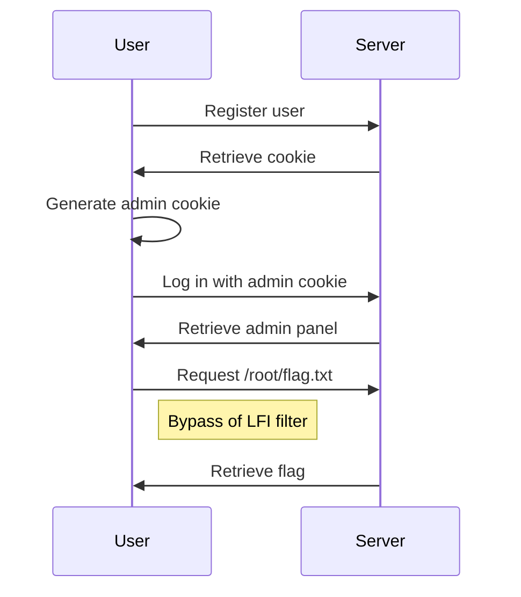

# OneTimeFilter

**Author:** Pengrey, Inryatt
**Category:** web
**Difficulty:** hard

## Setup
Run the following command
```
docker-compose up --build
```

## Description
On a recent leak some source code for a Warez website was found. The source code was for the `views.py` file of the website.

Do you think you can crack the security of the website with it?

## Files provided
The files found on the public folder should be provided to the player.

## Solve
To solve the challenge the player must firstly get the admin cookie. The cookie is generated by the server and is based a One Time Pad, the key is used therefore it's vulnerable. After getting the admin cookie the player must bypass the LFI filter and get the flag.

The following diagram shows the steps to solve the challenge.


To solve the challenge automatically the player can use the script found on the exploit folder as follows:
```bash
python3 exploit.py
```

## Flag
`CTFUA{W34K_C0OK13_4ND_W34K_F1LT3R_1S_4LL_Y0U_N33D}`
